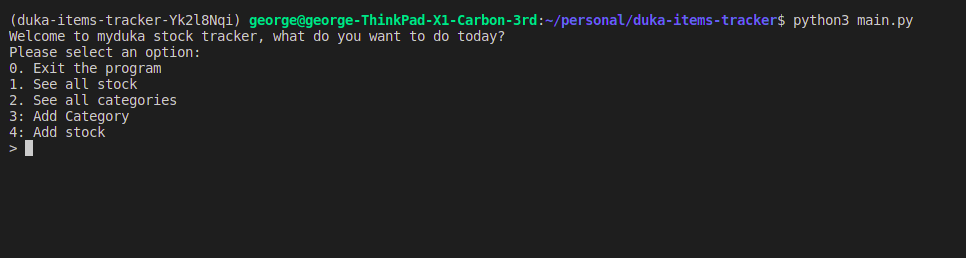

<h1>MyDuka Item Tracker CLI</h1>
<small> Track your duka stock through a very simple CLI </small>

<h2>Pre-requisites</h2>

<ul>
    <li>Python3 </li>
    <li>Sqlite3</li>
    <li>Pipenv</li>
</ul>

<h2>Instructions for use</h2>

- Fork the repo
- click watch to watch for updates
- clone the forked repo for test purposes

<h2>Contribution</h2>

- This project is still under development, and you can use it for learning and improving yourself.

To contribute to main repo:

- Create an issue with a feature you want to add then make PR.
- Or reach out to me on gokumu12@gmail.com

<h3>License</h3>

- MIT

Author: George Okumu

